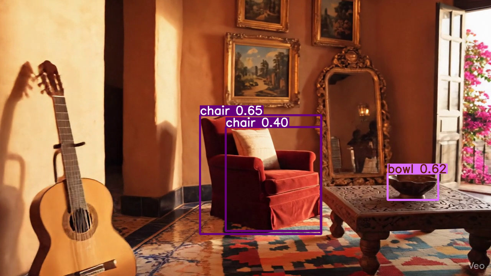

# AR Assistant: Juego de Realidad Aumentada

**AR Assistant** es un asistente de realidad aumentada que combina visión por computadora y procesamiento de voz para ofrecer un **juego interactivo** en tu entorno.

El objetivo: descubrir un **objeto secreto** mientras exploras tu entorno con la cámara y haces preguntas al asistente.  

---

## Cómo Jugar

1. **Inicia el juego** con un comando de voz.  
2. El asistente explica las reglas y comienza a **analizar el entorno**.  
3. Se selecciona un **objeto secreto** de la escena.  
4. Haz **preguntas o intenta adivinar** el objeto secreto.  
5. El asistente proporciona **pistas visuales y textuales** hasta que adivines correctamente.  

---

## Imágenes del Juego

### Objetos Detectados
Aquí puedes ver cómo AR Assistant identifica y resalta los objetos presentes en el entorno.

    

---

### Objeto Secreto
El sistema selecciona un objeto al azar como "objeto secreto", que el jugador debe descubrir mediante pistas y preguntas.

    

---

### Vídeo del Entorno
Simulación de la experiencia de AR en tiempo real, mostrando los objetos detectados y resaltados en el vídeo procesado.

    

## Experiencia del Usuario

- Interacción **natural por voz**.  
- Pistas visuales y textuales que guían la aventura.  
- Juego dinámico y entretenido que combina **visión, lenguaje e inteligencia artificial**.  

---

¡Descubre el objeto secreto y diviértete con AR Assistant!
